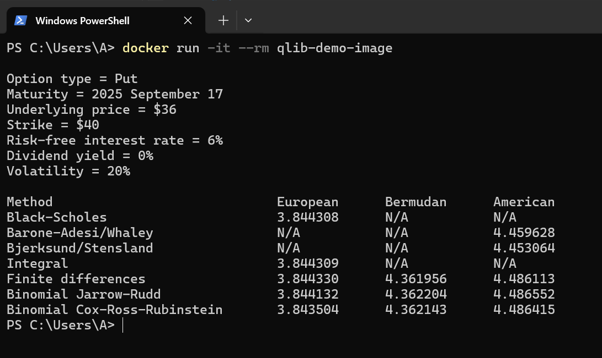
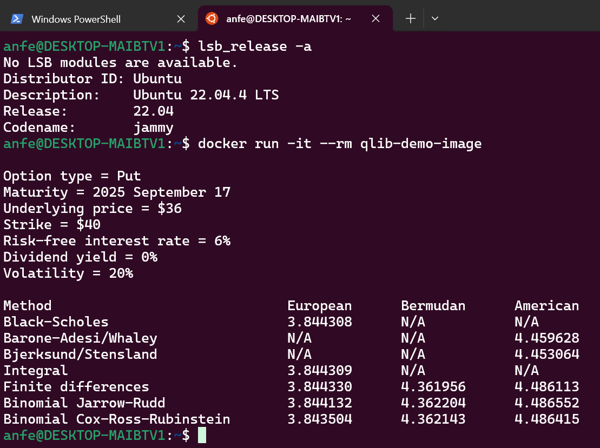

# vertr-qlib

## Quantlib C# Demo

Консольное приложение на C#, демонстрирующее расчет опционов c помощью библиотеки QuantLib.

### Build and Run in Docker

```bash
docker build -t qlib-demo-image -f Dockerfile .

docker run -it --rm qlib-demo-image
```

### Sample run






